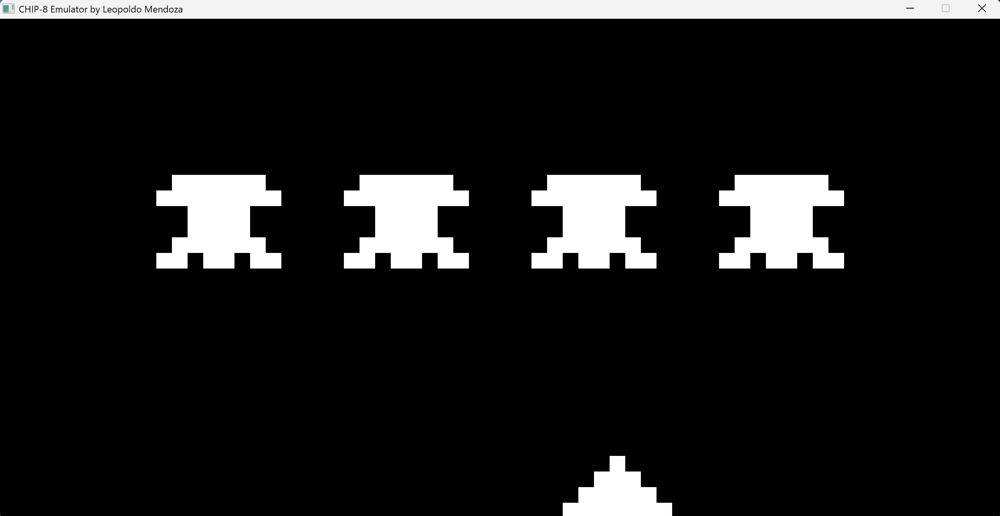

UNDER CONSTRUCTION

PC Demo

Status: Been done STM32 breadboard prototyping for 2 weeks. Finished schematic and PCB design last week. Waiting for JLCPCB and Digikey orders to be shipped, then assembly time!!!

Here's the top-level SW architecture for now:

