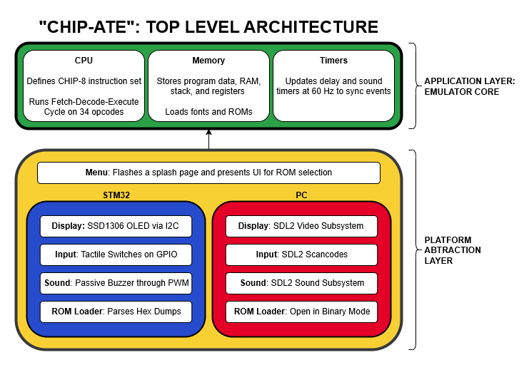
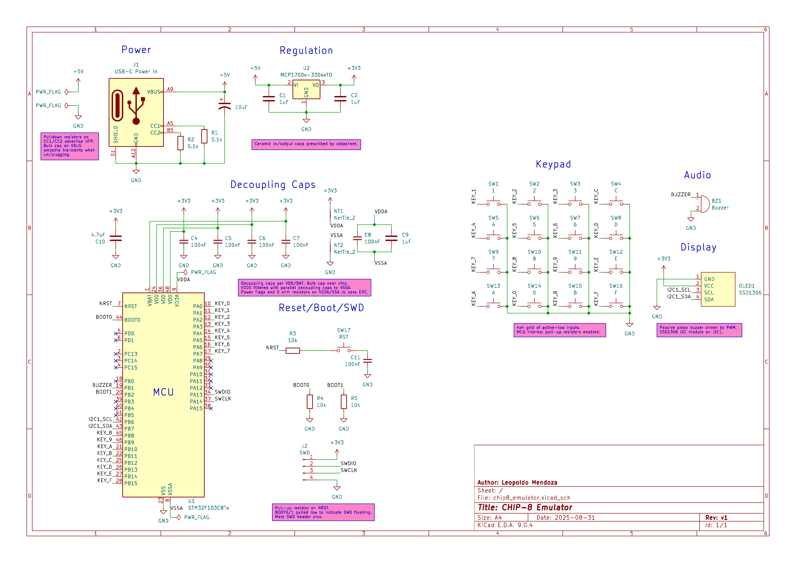
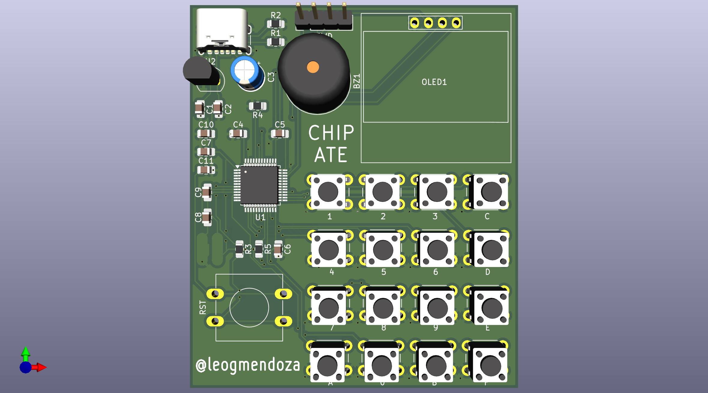
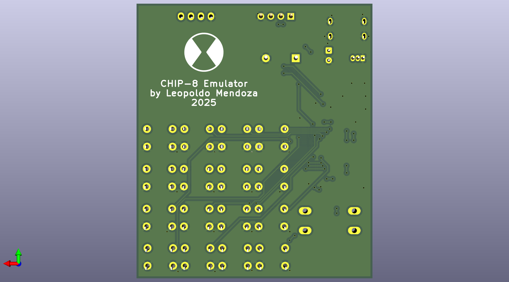
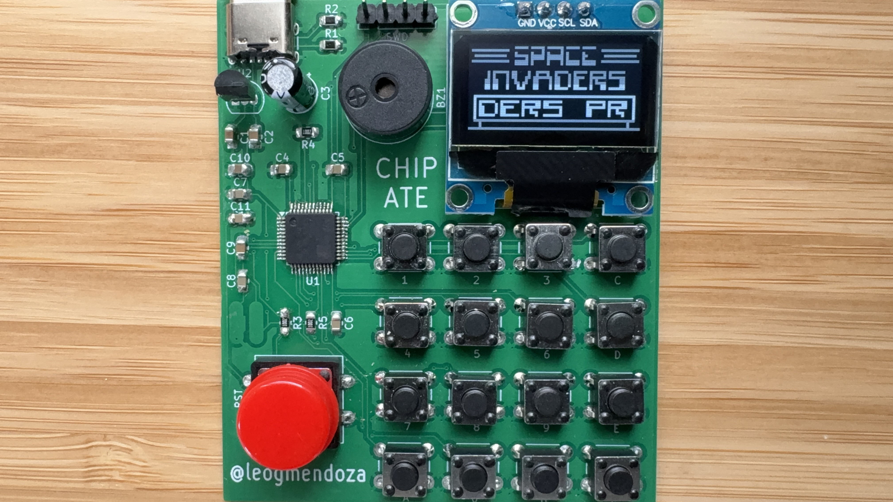
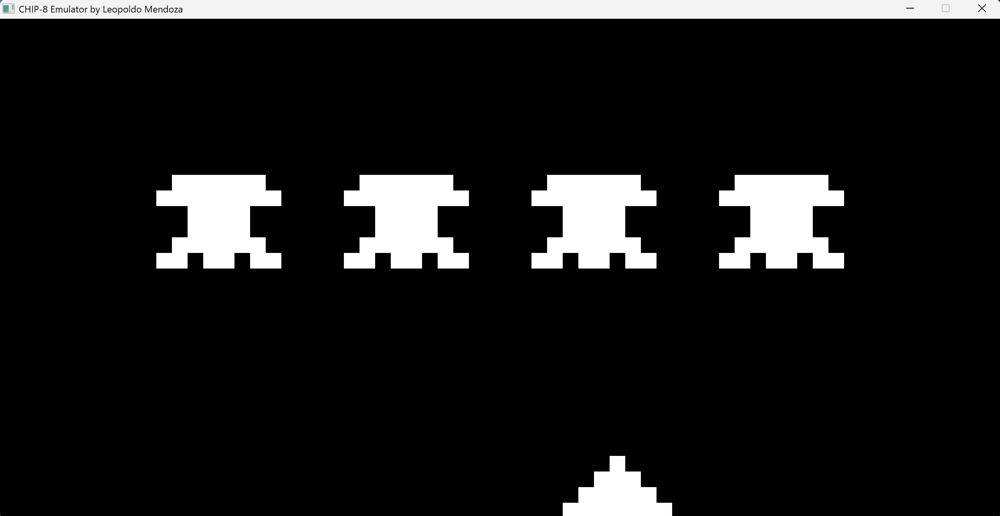
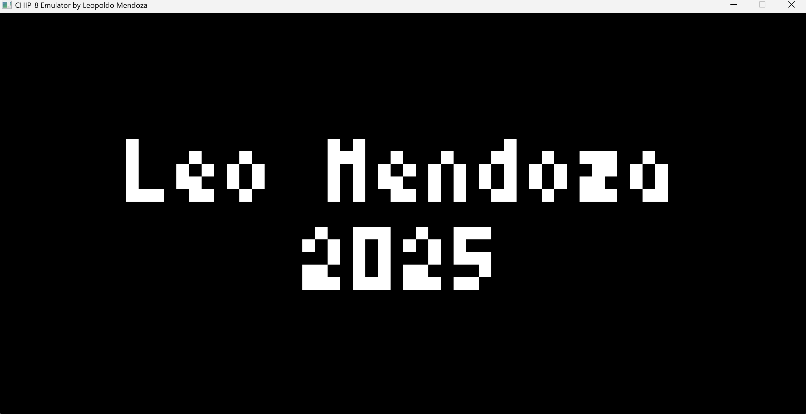
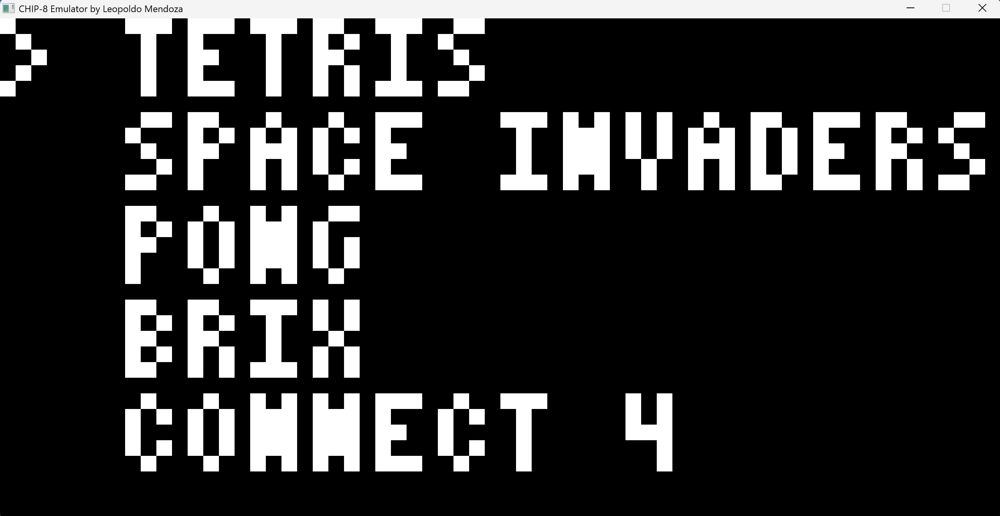
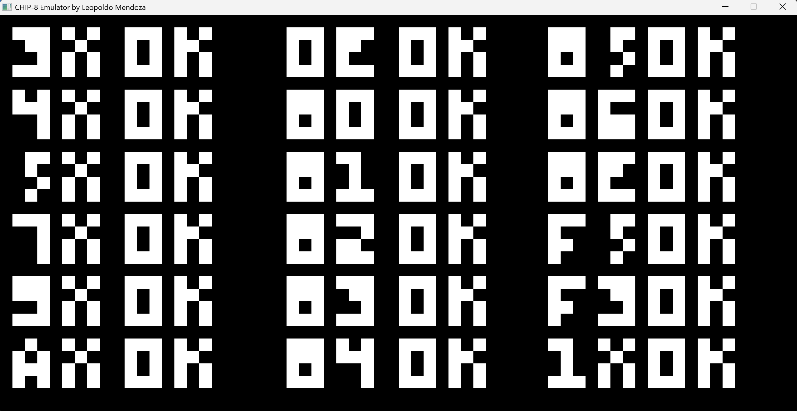

🚧UNDER CONSTRUCTION🚧

## What?

## Why?

## Features

## System Diagram

## PCB

### Schematic

### Routing

### Front Render

### Back Render

## 📸 STM32 Demos

### Demo Video (click it!)

## 📸 PC Demos

### Demo Video (click it!)

### Startup Screen

### Menu

### Opcode Test

## Resources

