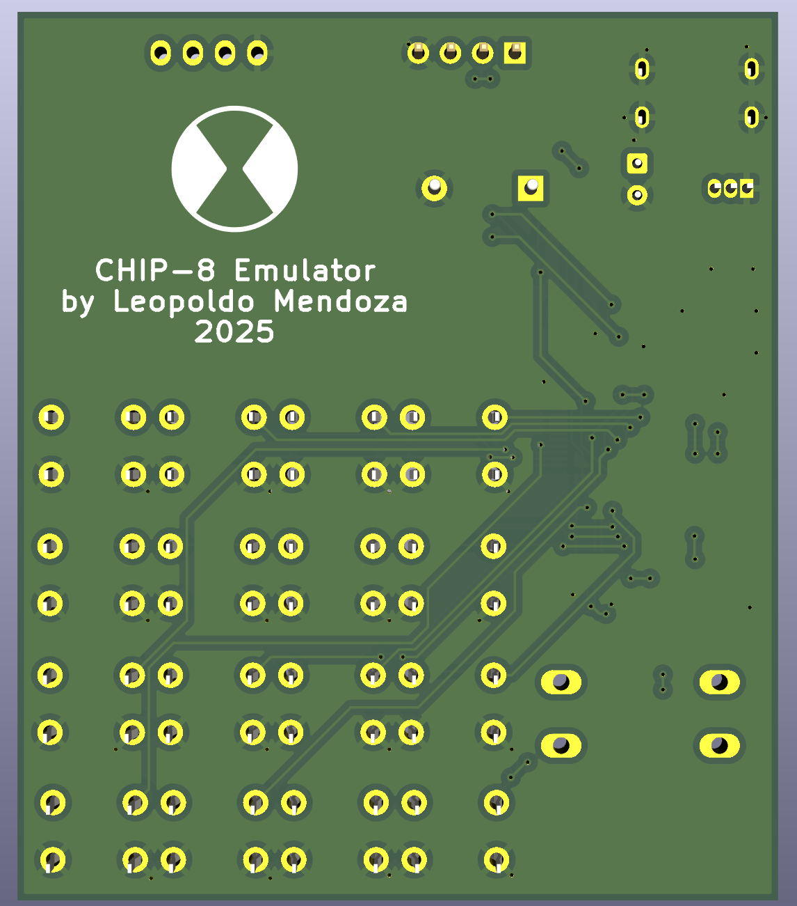

# CHIP ATE
 

## What?

## Why?

## Features

## System Diagram

## PCB

### Schematic

### Routing

### 3D Renders
 

## 📸 STM32 Demos

### Demo Video (click it!)

### Tetris

### Tic-Tac-Toe

### Pong

## 📸 PC Demos

### Demo Video (click it!)

### Startup Screen

### Menu

### Opcode Test

## Resources

