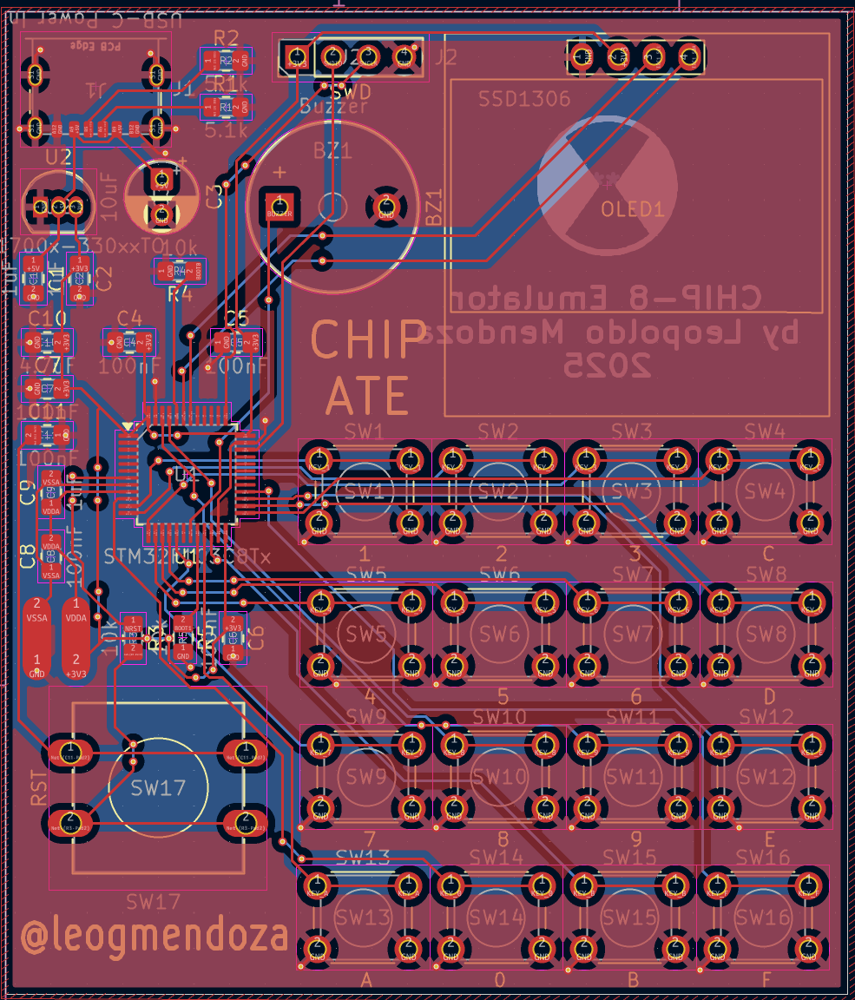

🚧UNDER CONSTRUCTION🚧

## What?

## Why?

## Features

## System Diagram

## PCB

### Schematic

### Routing

### Front Render

### Back Render

## 📸 Demos

### Demo Video - STM32
TO BE FILLED

### Demo Video - PC (click it!)

### Startup Screen

### Menu

### Opcode Test

