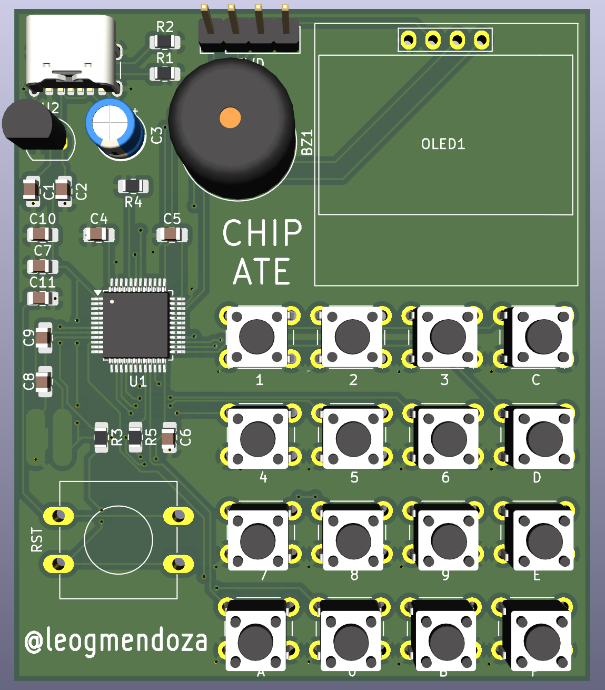

# 🍪 CHIP ATE
 

## 🤔 What?
CHIP ATE is a CHIP-8 Emulator implemented on both PC using SDL2 and STM32 with a custom PCB!

## 🤨 Why?
This was supposed to be my first step into console emulation, but then it became that for PCB design as well!

## Features
- **Portable Emulator Core**:  
  Implements the timers, memory, and CPU as per the [official CHIP-8 spec](http://devernay.free.fr/hacks/chip8/C8TECH10.HTM), including all 34 instructions

- **Platform Abstraction Layer**:  
  Able to run on either PC or STM32 using a platform-agnostic API layer
  
- **Custom PCB**:  
  Assembled on a STM32-based board with an OLED screen, keypad, a buzzer, and power regulation
  
- **ROM Menu**:  
  Provides seamless loading in and out of the ROM catalog

## Diagrams

### System Architecture

### Schematic

### Routing and 3D Renders
  

## 📸 STM32 Demos

### Demo Video (click it!)

### Tetris

### Tic-Tac-Toe

### Pong

## 📸 PC Demos

### Demo Video (click it!)

### Startup Screen

### Menu

### Opcode Test

## Resources
- [Guide to Making a CHIP-8 Emulator](https://tobiasvl.github.io/blog/write-a-chip-8-emulator/) by Tobias V. Langhoff
- [Building a CHIP-8 Emulator in C++](https://austinmorlan.com/posts/chip8_emulator/) by Austin Morlan
- [chip8stm32 Repo](https://github.com/AlfonsoJLuna/chip8stm32) by AlfonsoJLuna
- [KiCad Tutorial Playlist](https://youtube.com/playlist?list=PL3bNyZYHcRSUhUXUt51W6nKvxx2ORvUQB&si=zccgU5XXFSJnHfGM) by Shawn Hymel
- [KiCad 7 PCB Layout in 5 Steps](https://youtu.be/3FGNw28xBr0?si=mEvIMN-HYlVow5y7) by The Design Graveyard
